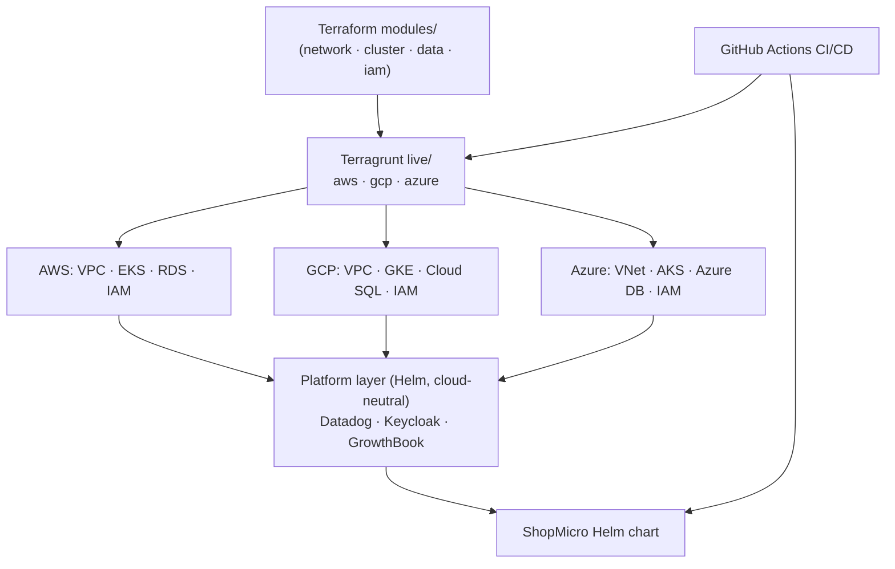

## The shape of the system

CloudDeploy is **reusable Terraform modules, driven per-cloud by Terragrunt, running one workload three ways**.

The **modules** are written once and describe *what* a piece of infrastructure is — a network, a cluster, a database, an IAM setup — with the cloud-specific details inside. **Terragrunt** is the layer that says *where* and *with what config*: a `live/aws`, `live/gcp`, and `live/azure` tree that calls the same modules with per-cloud inputs, keeps state in each cloud's remote backend with locking, and lets `terragrunt run --all` plan or apply the whole platform. On top of every cluster sits a **cloud-neutral platform layer** — Datadog, Keycloak, GrowthBook — deployed by Helm, so those services are identical no matter which cloud they land on. Then **ShopMicro's Helm chart** is the workload, and **GitHub Actions** is what runs the whole thing on a PR-and-merge cadence.

## Why this shape

- **Modules describe intent; Terragrunt supplies context.** Splitting "what infrastructure is" (modules) from "which cloud, which region, which inputs" (Terragrunt `live/`) is what makes three clouds tractable instead of three copies of everything.
- **Remote state with locking, per cloud.** State is the source of truth for what exists; keeping it in each cloud's backend (S3 / GCS / Azure Storage) with locking is what lets a team — or a CI job — apply safely without clobbering each other.
- **The platform layer is deliberately cloud-neutral.** Observability, identity, and flags shouldn't be re-learned per cloud, so they run *on* Kubernetes via Helm and don't care whether they're on EKS, GKE, or AKS. Only the layers below them (network, cluster, data, IAM) are cloud-specific.
- **CI/CD is the safety rail.** `terragrunt plan` on a PR shows exactly what will change before it changes; apply-on-merge makes the repo the single source of truth for the platform.

The costs are real and named throughout: multi-cloud means three IAM models to get right, three ways to expose an ingress, per-cloud managed-DB differences, and real money running three clusters — which is why the final module is about drift, cost, and clean teardown.

## The pieces

- **Terraform `modules/`** — reusable `network`, `cluster`, `data`, `iam` modules with per-cloud implementations.
- **Terragrunt `live/{aws,gcp,azure}/`** — DRY per-cloud config, remote state + locking, `run --all`.
- **Clusters** — EKS (AWS), GKE (GCP), AKS (Azure), each with node pools and networking.
- **Managed data** — RDS / Cloud SQL / Azure Database for PostgreSQL.
- **Platform layer (Helm)** — Datadog agent, Keycloak, GrowthBook — cloud-neutral.
- **Workload** — the ShopMicro Helm chart, behind ingress + DNS, per cloud.
- **CI/CD** — GitHub Actions: plan on PR, apply + deploy on merge, cloud matrix.

## Verify

You're ready to move on when you can answer these in your own words:

- What does a Terraform *module* own versus what a Terragrunt `live/` directory owns? Why does that split make three clouds manageable?
- Why do Datadog, Keycloak, and GrowthBook run as a Helm-deployed "platform layer" instead of being provisioned per cloud like the network and cluster are?
- What does remote state with locking protect against, and why does each cloud keep its own?
- Name three concrete places the three clouds genuinely differ that a single-cloud course would never surface.

Next, the [prerequisites](/clouddeploy/en/introduction/prerequisites/) get your accounts and tools ready.
