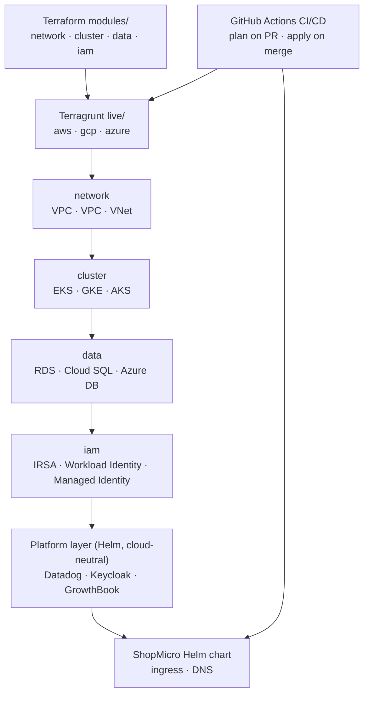

## What you built

You started with an empty repository and ended with a **production-shaped platform you can reproduce from nothing on three clouds**. Not a diagram of one — the real thing: a reusable set of Terraform modules, a Terragrunt `live/` tree per cloud with remote state and locking, managed Kubernetes on AWS, GCP, and Azure, a cloud-neutral platform layer, ShopMicro running as the workload, and a CI/CD pipeline that plans on a PR and applies on merge.

Concretely, by the end you had:

- **Reusable modules** — `network`, `cluster`, `data`, and `iam`, each with a per-cloud implementation behind an identical interface.
- **A `live/{aws,gcp,azure}/` tree** — Terragrunt units that wire those modules together with `dependency` blocks, backed by S3 / GCS / Azure Storage state with locking.
- **Three managed clusters** — EKS, GKE, and AKS, provisioned by Terraform, each reachable through its own kubeconfig and the `kubernetes` + `helm` providers.
- **Managed Postgres** per cloud — RDS, Cloud SQL, and Azure Database for PostgreSQL — with the connection secret handed to ShopMicro.
- **Workload identity** — IRSA, GCP Workload Identity, and Azure Managed Identity — so a pod gets cloud access with no static keys.
- **A platform layer** — Datadog, Keycloak, and GrowthBook — deployed by Helm and identical regardless of which cloud it lands on.
- **ShopMicro** — the microservices system from project #3 — running behind ingress and DNS on every cluster.
- **CI/CD** — GitHub Actions running `terragrunt` plans on PRs and applies plus Helm deploys on merge, across a cloud matrix, with OIDC-based cloud auth.

The point was never any one of these in isolation. It was making them fit together so that "the platform" is a thing you `apply`, not a runbook you follow by hand.

## From modules to a running platform

Everything you built flows in one direction — from reusable code, through per-cloud configuration, into a running stack, with CI/CD driving the whole thing:

Read it top to bottom: the **modules** describe *what* each piece of infrastructure is, once. **Terragrunt `live/`** supplies *where and with what inputs*, per cloud. The four infrastructure units apply in dependency order — `network` before `cluster`, `cluster` and `network` before `data`, and `iam` binding a service account to the cluster. On top sits the **platform layer**, which doesn't care which cloud it's on, and then **ShopMicro** as the workload. **CI/CD** wraps around it: it drives the `live/` tree and the Helm deploys so the repository, not a person's laptop, is the source of truth.

## The decisions you can now defend

The value of a capstone isn't the artifact — it's that you made real architectural calls and can now argue for them, trade-offs included:

| Decision | Why | Trade-off | Lesson |
| --- | --- | --- | --- |
| Multi-cloud, not one cloud deep | Proves the platform is portable and forces the real differences (IAM, ingress, managed DB) into the open | Shallower per cloud than a single-cloud deep dive; three of everything to keep working | [Cost & teardown →](/clouddeploy/en/multi-cloud/cost-and-teardown/) |
| Split `modules/` from `live/` | Separates "what infrastructure is" from "which cloud, which inputs" — three clouds become config, not three copies | One more layer to learn; the indirection can hide where a value comes from | [DRY with Terragrunt →](/clouddeploy/en/terragrunt/dry-with-terragrunt/) |
| Identical module interface per cloud | Lets every `live/` unit wire dependencies the same way; only the implementation differs | The interface has to fit the *least* capable cloud, so some cloud-specific power goes unused | [The network module →](/clouddeploy/en/networking/the-network-module/) |
| Cloud-neutral platform layer (Helm) | Observability, identity, and flags are learned once and run identically on EKS, GKE, or AKS | You run and patch them yourself instead of using each cloud's managed equivalent | [The Datadog agent →](/clouddeploy/en/datadog/the-datadog-agent/) |
| Remote state with locking, per cloud | State is the source of truth for what exists; locking stops two applies from clobbering each other | Backend bootstrapping is a chicken-and-egg step; state is now infrastructure you must protect | [Remote state & locking →](/clouddeploy/en/terragrunt/remote-state-and-locking/) |
| OIDC auth in CI | CI gets short-lived, per-cloud credentials with no long-lived keys sitting in secrets | More upfront setup — a trust relationship and role per cloud — than pasting an access key | [Plan on PR →](/clouddeploy/en/cicd/plan-on-pr/) |

If someone asks "why three clouds?" or "why is Datadog in Helm and not a managed service?", you have an answer that names the cost, not just the benefit. That's the difference between copying a pattern and owning one.

## What was deliberately simplified

A capstone teaches by keeping each concern to a teachable core. Several things here are one honest step short of production, on purpose — and knowing *which* corners were cut is part of understanding the system:

- **One environment per cloud.** There's no `dev` / `staging` / `prod` split — just "the platform." Real teams add environments; the `live/` tree is exactly where they'd go.
- **One region per cloud.** `us-east-1`, `us-central1`, `eastus`. No multi-region, no failover. Enough to be real, not enough to be highly available.
- **Small node pools.** Two small nodes per cluster keeps the bill teachable. Nothing about the modules assumes that number.
- **One workload.** ShopMicro is the only app. The platform would host more, but a second workload would only repeat the pattern you already have.
- **A representative slice of each platform tool.** Datadog watches the key signals rather than everything; Keycloak protects the gateway with one realm and client; GrowthBook gates a single feature. The wiring is real — the coverage is illustrative.

None of these are gaps to apologize for. They're the line between "learn the pattern" and "operate it at scale" — and the [next lesson](/clouddeploy/en/wrap-up/next-steps/) is about crossing it deliberately.

## Recap

You can now provision, observe, secure, and tear down a multi-cloud platform entirely as code — and, more importantly, defend the shape of it. You know why the modules and the `live/` tree are separate, why the platform layer is cloud-neutral, and what running three clusters actually costs.

This lesson also closes the **six-project Real-World Projects series**. Each guide rebuilt a different real application from an empty repo, and CloudDeploy is where one of them — ShopMicro — finally runs in the world. If you haven't worked through the others, they're all live:

- [TaskFlow →](https://projects.avetavos.com/taskflow) — realtime Kanban board (Rust · Redis · Astro)
- [DevBlog →](https://projects.avetavos.com/devblog) — headless CMS + blog (NestJS · GraphQL · Next.js)
- [ShopMicro →](https://projects.avetavos.com/shopmicro) — e-commerce microservices (Go · gRPC · Kafka · Kubernetes) — the workload you just deployed
- [FitTrack →](https://projects.avetavos.com/fittrack) — mobile-first fitness app (FastAPI · Flutter · Svelte)
- [Mosaic →](https://projects.avetavos.com/mosaic) — micro-frontend storefront (React · Svelte · Module Federation)
- [OfflineNotes →](https://projects.avetavos.com/offlinenotes) — offline-first PWA (TypeScript · WASM CRDT · Astro)

Next, [Next steps →](/clouddeploy/en/wrap-up/next-steps/) lays out the concrete extensions that take this platform from a teachable core toward something you'd run for real.
