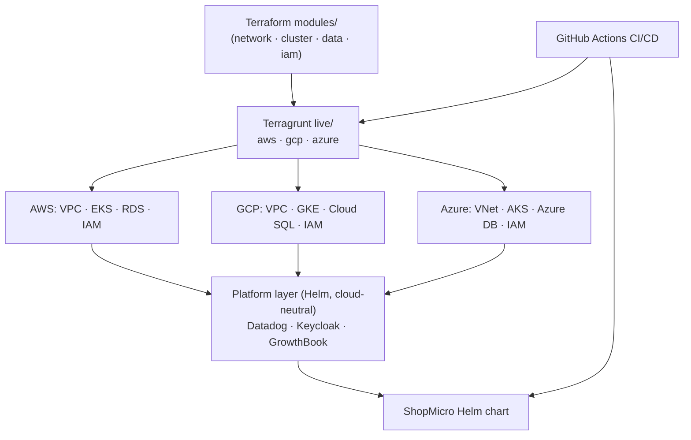

## The shape of the system

CloudDeploy คือ **Terraform module ที่นำกลับมาใช้ซ้ำได้, ขับต่อ cloud ด้วย Terragrunt, รัน workload เดียวสามแบบ**

**module** เขียนครั้งเดียวและอธิบายว่า infrastructure ชิ้นหนึ่ง *คืออะไร* — network, cluster, database, หรือ IAM setup — โดยมีรายละเอียดเฉพาะ cloud อยู่ข้างใน **Terragrunt** คือ layer ที่บอกว่า *ที่ไหน* และ *ด้วย config อะไร*: tree `live/aws`, `live/gcp`, และ `live/azure` ที่เรียก module เดียวกันด้วย input ต่อ cloud, เก็บ state ใน remote backend ของแต่ละ cloud พร้อม locking, และให้ `terragrunt run-all` plan หรือ apply ทั้ง platform ได้ บนทุก cluster มี **platform layer ที่เป็นกลางต่อ cloud** วางอยู่ด้านบน — Datadog, Keycloak, GrowthBook — deploy ด้วย Helm ทำให้ service เหล่านั้นเหมือนกันหมดไม่ว่าจะไปลงบน cloud ไหน จากนั้น **Helm chart ของ ShopMicro** คือ workload และ **GitHub Actions** คือสิ่งที่รันทั้งหมดตามจังหวะ PR-แล้ว-merge

## Why this shape

- **module อธิบาย intent; Terragrunt จัดหา context** การแยก "infrastructure คืออะไร" (module) ออกจาก "cloud ไหน region ไหน input อะไร" (Terragrunt `live/`) คือสิ่งที่ทำให้สาม cloud จัดการไหว แทนที่จะเป็นสำเนาทุกอย่างสามชุด
- **remote state พร้อม locking ต่อ cloud** state คือแหล่งความจริงว่ามีอะไรอยู่บ้าง การเก็บมันไว้ใน backend ของแต่ละ cloud (S3 / GCS / Azure Storage) พร้อม locking คือสิ่งที่ให้ทีม — หรือ CI job — apply ได้อย่างปลอดภัยโดยไม่ทับกันเอง
- **platform layer จงใจให้เป็นกลางต่อ cloud** observability, identity, และ flag ไม่ควรต้องมาเรียนรู้ใหม่ต่อ cloud มันจึงรัน *บน* Kubernetes ผ่าน Helm และไม่สนว่าตัวเองอยู่บน EKS, GKE, หรือ AKS มีเพียง layer ที่อยู่ข้างใต้ (network, cluster, data, IAM) เท่านั้นที่เป็นเฉพาะ cloud
- **CI/CD คือราวกันตก** `terragrunt plan` บน PR แสดงชัดว่าอะไรจะเปลี่ยนก่อนที่มันจะเปลี่ยน; การ apply ตอน merge ทำให้ repo เป็นแหล่งความจริงหนึ่งเดียวของ platform

ต้นทุนมีจริงและถูกพูดถึงตลอด: multi-cloud หมายถึง IAM สามแบบที่ต้องทำให้ถูก, สามวิธีในการ expose ingress, ความต่างของ managed DB ต่อ cloud, และเงินจริงในการรันสาม cluster — ซึ่งเป็นเหตุผลว่าทำไม module สุดท้ายถึงว่าด้วย drift, cost, และ teardown ที่สะอาด

## The pieces

- **Terraform `modules/`** — module `network`, `cluster`, `data`, `iam` ที่นำกลับมาใช้ซ้ำได้ พร้อม implementation ต่อ cloud
- **Terragrunt `live/{aws,gcp,azure}/`** — config ต่อ cloud แบบ DRY, remote state + locking, `run-all`
- **Cluster** — EKS (AWS), GKE (GCP), AKS (Azure) แต่ละตัวมี node pool และ networking
- **Managed data** — RDS / Cloud SQL / Azure Database for PostgreSQL
- **Platform layer (Helm)** — Datadog agent, Keycloak, GrowthBook — เป็นกลางต่อ cloud
- **Workload** — Helm chart ของ ShopMicro หลัง ingress + DNS ต่อ cloud
- **CI/CD** — GitHub Actions: plan ตอน PR, apply + deploy ตอน merge, cloud matrix

## Verify

คุณพร้อมไปต่อเมื่อคุณตอบคำถามพวกนี้ด้วยคำพูดของคุณเองได้:

- Terraform *module* เป็นเจ้าของอะไร เทียบกับที่ directory `live/` ของ Terragrunt เป็นเจ้าของอะไร? ทำไมการแยกแบบนั้นถึงทำให้สาม cloud จัดการได้?
- ทำไม Datadog, Keycloak, และ GrowthBook ถึงรันเป็น "platform layer" ที่ deploy ด้วย Helm แทนที่จะ provision ต่อ cloud เหมือน network และ cluster?
- remote state พร้อม locking ป้องกันอะไร และทำไมแต่ละ cloud ถึงเก็บของตัวเอง?
- ยกตัวอย่างสามจุดที่สาม cloud ต่างกันจริง ๆ ซึ่งคอร์ส single-cloud จะไม่มีวันได้เห็น

ต่อไป [prerequisites](/clouddeploy/th/introduction/prerequisites/) จะเตรียม account และเครื่องมือของคุณให้พร้อม
