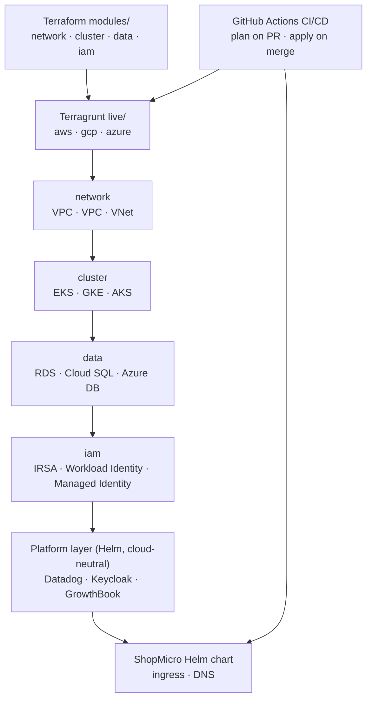

## What you built

คุณเริ่มจาก repository ว่างเปล่าและจบด้วย **platform รูปทรง production ที่คุณ reproduce จากศูนย์ได้บนสาม cloud** ไม่ใช่ diagram ของมัน — ของจริง: ชุด Terraform module ที่ reuse ได้, Terragrunt `live/` tree ต่อ cloud พร้อม remote state และ locking, managed Kubernetes บน AWS, GCP, และ Azure, platform layer ที่ cloud-neutral, ShopMicro รันเป็น workload, และ CI/CD pipeline ที่ plan บน PR และ apply บน merge

เป็นรูปธรรม ตอนจบคุณมี:

- **Reusable module** — `network`, `cluster`, `data`, และ `iam` แต่ละตัวมี implementation ต่อ cloud อยู่หลัง interface เดียวกัน
- **`live/{aws,gcp,azure}/` tree** — Terragrunt unit ที่ต่อสาย module พวกนั้นเข้าด้วยกันด้วย `dependency` block, backed ด้วย S3 / GCS / Azure Storage state พร้อม locking
- **สาม managed cluster** — EKS, GKE, และ AKS, provision โดย Terraform, แต่ละตัวเข้าถึงได้ผ่าน kubeconfig ของตัวเองและ provider `kubernetes` + `helm`
- **Managed Postgres** ต่อ cloud — RDS, Cloud SQL, และ Azure Database for PostgreSQL — พร้อม connection secret ที่ส่งให้ ShopMicro
- **Workload identity** — IRSA, GCP Workload Identity, และ Azure Managed Identity — เพื่อให้ pod ได้ cloud access โดยไม่มี static key
- **platform layer** — Datadog, Keycloak, และ GrowthBook — deploy โดย Helm และเหมือนกันไม่ว่ามันจะลงบน cloud ไหน
- **ShopMicro** — ระบบ microservices จาก project #3 — รันหลัง ingress และ DNS บนทุก cluster
- **CI/CD** — GitHub Actions รัน `terragrunt` plan บน PR และ apply บวก Helm deploy บน merge ข้าม cloud matrix พร้อม OIDC-based cloud auth

ประเด็นไม่เคยเป็นตัวใดตัวหนึ่งแบบโดด ๆ มันคือการทำให้มันประกอบกันได้เพื่อให้ "the platform" เป็นสิ่งที่คุณ `apply` ไม่ใช่ runbook ที่คุณทำตามด้วยมือ

## From modules to a running platform

ทุกอย่างที่คุณสร้างไหลไปทิศเดียว — จาก code ที่ reuse ได้ ผ่าน configuration ต่อ cloud เข้าสู่ stack ที่รันอยู่ โดยมี CI/CD ขับทั้งหมด:

อ่านมันจากบนลงล่าง: **module** อธิบาย *ว่า* แต่ละชิ้นของ infrastructure คืออะไร ครั้งเดียว **Terragrunt `live/`** จัดหา *ที่ไหนและด้วย input อะไร* ต่อ cloud สี่ infrastructure unit apply ในลำดับ dependency — `network` ก่อน `cluster`, `cluster` และ `network` ก่อน `data`, และ `iam` bind service account เข้ากับ cluster ด้านบนคือ **platform layer** ที่ไม่สนว่ามันอยู่บน cloud ไหน และจากนั้น **ShopMicro** เป็น workload **CI/CD** ห่อรอบมัน: มันขับ `live/` tree และ Helm deploy เพื่อให้ repository ไม่ใช่ laptop ของใครคนหนึ่ง เป็น source of truth

## The decisions you can now defend

คุณค่าของ capstone ไม่ใช่ artifact — มันคือการที่คุณตัดสินใจ architectural จริง ๆ และตอนนี้ argue สนับสนุนมันได้ รวม trade-off ด้วย:

| Decision | Why | Trade-off | Lesson |
| --- | --- | --- | --- |
| Multi-cloud, not one cloud deep | พิสูจน์ว่า platform portable และบังคับความต่างจริง (IAM, ingress, managed DB) ให้เปิดออกมา | ตื้นกว่าต่อ cloud เทียบกับ single-cloud deep dive; ทุกอย่างสามชุดที่ต้องคอยให้ทำงาน | [Cost & teardown →](/clouddeploy/th/multi-cloud/cost-and-teardown/) |
| Split `modules/` from `live/` | แยก "infrastructure คืออะไร" ออกจาก "cloud ไหน, input ไหน" — สาม cloud กลายเป็น config ไม่ใช่สามสำเนา | อีกหนึ่ง layer ที่ต้องเรียน; indirection ซ่อนที่มาของ value ได้ | [DRY with Terragrunt →](/clouddeploy/th/terragrunt/dry-with-terragrunt/) |
| Identical module interface per cloud | ให้ทุก `live/` unit ต่อสาย dependency แบบเดียวกัน; ต่างแค่ implementation | interface ต้อง fit cloud ที่ *มีความสามารถน้อยที่สุด* ดังนั้น power เฉพาะ cloud บางอย่างไม่ถูกใช้ | [The network module →](/clouddeploy/th/networking/the-network-module/) |
| Cloud-neutral platform layer (Helm) | observability, identity, และ flag เรียนครั้งเดียวและรันเหมือนกันบน EKS, GKE, หรือ AKS | คุณรันและ patch มันเองแทนที่จะใช้ managed equivalent ของแต่ละ cloud | [The Datadog agent →](/clouddeploy/th/datadog/the-datadog-agent/) |
| Remote state with locking, per cloud | State คือ source of truth ของสิ่งที่มีอยู่; locking หยุดสอง apply ไม่ให้ทับกัน | Backend bootstrapping คือขั้น chicken-and-egg; state ตอนนี้เป็น infrastructure ที่คุณต้องปกป้อง | [Remote state & locking →](/clouddeploy/th/terragrunt/remote-state-and-locking/) |
| OIDC auth in CI | CI ได้ credential ต่อ cloud อายุสั้นโดยไม่มี key อายุยาวนั่งอยู่ใน secret | setup ล่วงหน้ามากกว่า — trust relationship และ role ต่อ cloud — เทียบกับการ paste access key | [Plan on PR →](/clouddeploy/th/cicd/plan-on-pr/) |

ถ้ามีคนถาม "ทำไมสาม cloud?" หรือ "ทำไม Datadog อยู่ใน Helm ไม่ใช่ managed service?" คุณมีคำตอบที่เรียกชื่อ cost ไม่ใช่แค่ประโยชน์ นั่นคือความต่างระหว่างการ copy pattern กับการ own มัน

## What was deliberately simplified

capstone สอนโดยเก็บแต่ละ concern ให้เหลือแก่นที่สอนได้ หลายสิ่งตรงนี้ห่างจาก production หนึ่งก้าวอย่างซื่อสัตย์ โดยตั้งใจ — และการรู้ว่า *มุมไหน* ถูกตัดเป็นส่วนหนึ่งของการเข้าใจระบบ:

- **หนึ่ง environment ต่อ cloud** ไม่มีการแยก `dev` / `staging` / `prod` — แค่ "the platform" ทีมจริงเพิ่ม environment; `live/` tree คือที่ที่มันจะไปพอดี
- **หนึ่ง region ต่อ cloud** `us-east-1`, `us-central1`, `eastus` ไม่มี multi-region, ไม่มี failover พอที่จะเป็นของจริง ไม่พอที่จะ highly available
- **Node pool เล็ก** สอง node เล็กต่อ cluster ทำให้ bill สอนได้ ไม่มีอะไรใน module สมมติจำนวนนั้น
- **หนึ่ง workload** ShopMicro เป็น app เดียว platform จะ host ได้มากกว่านี้ แต่ workload ที่สองจะแค่ทำซ้ำ pattern ที่คุณมีอยู่แล้ว
- **slice ตัวแทนของแต่ละ platform tool** Datadog เฝ้า signal สำคัญแทนที่จะเฝ้าทุกอย่าง; Keycloak ปกป้อง gateway ด้วยหนึ่ง realm และ client; GrowthBook gate หนึ่ง feature การต่อสายเป็นของจริง — coverage เป็นการยกตัวอย่าง

ไม่มีข้อไหนเป็นช่องว่างที่ต้องขอโทษ มันคือเส้นแบ่งระหว่าง "เรียน pattern" กับ "operate มันที่ scale" — และ [next lesson](/clouddeploy/th/wrap-up/next-steps/) คือเรื่องการข้ามมันอย่างจงใจ

## Recap

ตอนนี้คุณ provision, observe, secure, และ tear down multi-cloud platform ทั้งหมดเป็น code ได้ — และที่สำคัญกว่า defend รูปทรงของมันได้ คุณรู้ว่าทำไม module กับ `live/` tree ถึงแยกกัน, ทำไม platform layer ถึง cloud-neutral, และการรันสาม cluster cost เท่าไหร่จริง ๆ

บทนี้ยังปิด **six-project Real-World Projects series** ด้วย แต่ละ guide rebuild แอปพลิเคชันจริงคนละตัวจาก repo ว่างเปล่า และ CloudDeploy คือที่ที่หนึ่งในนั้น — ShopMicro — ในที่สุดก็รันในโลกจริง ถ้าคุณยังไม่ได้ทำตัวอื่น มันรันอยู่ทั้งหมด:

- [TaskFlow →](https://projects.avetavos.com/taskflow) — realtime Kanban board (Rust · Redis · Astro)
- [DevBlog →](https://projects.avetavos.com/devblog) — headless CMS + blog (NestJS · GraphQL · Next.js)
- [ShopMicro →](https://projects.avetavos.com/shopmicro) — e-commerce microservices (Go · gRPC · Kafka · Kubernetes) — workload ที่คุณเพิ่ง deploy
- [FitTrack →](https://projects.avetavos.com/fittrack) — mobile-first fitness app (FastAPI · Flutter · Svelte)
- [Mosaic →](https://projects.avetavos.com/mosaic) — micro-frontend storefront (React · Svelte · Module Federation)
- [OfflineNotes →](https://projects.avetavos.com/offlinenotes) — offline-first PWA (TypeScript · WASM CRDT · Astro)

ถัดไป [Next steps →](/clouddeploy/th/wrap-up/next-steps/) วาง extension ที่เป็นรูปธรรมซึ่งพา platform นี้จากแก่นที่สอนได้ไปสู่สิ่งที่คุณจะรันจริง
